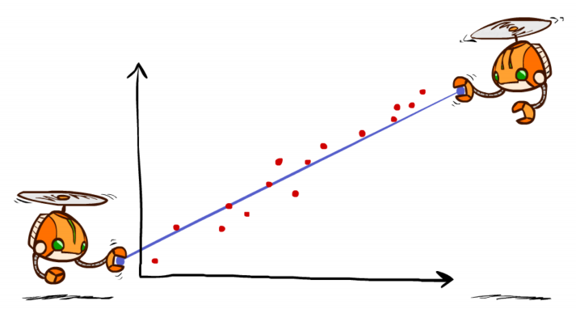
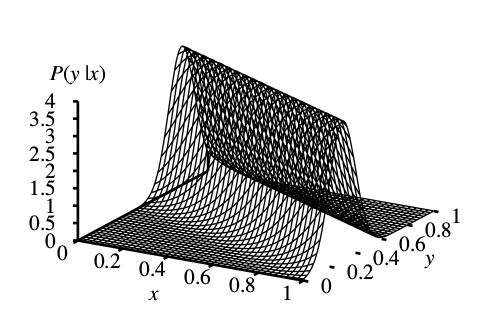
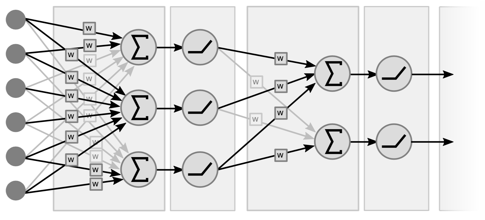

class: middle, center, title-slide

# Introduction to Artificial Intelligence

Lecture 7: Learning

  
Prof. Gilles Louppe 
[g.louppe@uliege.be](mailto:g.louppe@uliege.be)

???

R: develop linear regression / OLS  further ---> up to the analytical solution

---

class: middle, center

.width-50[]

---

# Today

.center.width-50[]

Make our agents capable of self-improvement through a **learning** mechanism.
- Bayesian learning
- Supervised learning
- Unsupervised learning (Bonus)

.footnote[Image credits: [CS188](https://inst.eecs.berkeley.edu/~cs188/), UC Berkeley.]

---

# Intelligence?

What we cover in this course:
- Search algorithms, using a state space specified by domain knowledge.
- (Constraint satisfaction problems, by exploiting a known structure of the states.)
- (Logical inference, using well-specified facts and inference rules.)
- Adversarial search, for known and fully observable games.
- Reasoning about uncertain knowledge, as represented using domain-motivated probabilistic models.
- Taking optimal decisions, under uncertainty and possibly under partial observation.

Sufficient to implement complex and rational behaviors, in some situations.

.alert[Aren't we missing something?]

???

Is that intelligence? Aren't we missing a critical component?
=> Learning component

The auestion is then to determine what should be pre-defined from what should be learned.

---

class: middle

## Learning agents

What if the environment is **unknown**?
- Learning can be used as a system construction method.
- Expose the agent to reality rather than trying to hardcode reality into the agent's program.
- Learning provides an automated way to modify the agent's internal decision mechanisms to improve its own performance.

---

class: middle

.center.width-80[]

???

- Performance element:
    - The current system for selecting actions.
- The *critic* observes the world and passes information to the *learning element*.
    - The learning element tries to modifies the performance element to avoid reproducing this situation in the future.
- The problem generator identifies certain areas of behavior in need of improvement and suggest experiments.

---

class: middle

The design of the **learning element** is dictated by:
- What type of performance element is used.
- Which functional component is to be learned.
- How that functional component is represented.
- What kind of feedback is available.

  
.center.width-80[]

---

class: middle

# Bayesian learning

---

# Bayesian learning

Frame **learning** as a Bayesian update of a probability distribution ${\bf P}(H)$ over a hypothesis space, where
- $H$ is the hypothesis variable
- values are $h\_1$, $h\_2$, ...
- the prior is ${\bf P}(H)$,
- $\mathbf{d}$ is the observed data.

---

class: middle

Given data, each hypothesis has a posterior probability
$$P(h\_i|\mathbf{d}) = \frac{P(\mathbf{d}|h\_i) P(h\_i)}{P(\mathbf{d})},$$ where $P(\mathbf{d}|h\_i)$ is the likelihood of the hypothesis.

---

class: middle

Predictions use a likelihood-weighted average over the hypotheses:
$$P(X|\mathbf{d}) = \sum\_i P(X|\mathbf{d}, h\_i) P(h\_i | \mathbf{d}) = \sum\_i P(X|h\_i) P(h\_i | \mathbf{d})$$
No need to pick one best-guess hypothesis!

---

class: middle

## Example

Suppose there are five kinds of bags of candies. Assume a prior ${\bf P}(H)$:
- $P(h\_1)=0.1$, with $h\_1$: 100% cherry candies
- $P(h\_2)=0.2$, with $h\_2$: 75% cherry candies + 25% lime candies
- $P(h\_3)=0.4$, with $h\_3$: 50% cherry candies + 50% lime candies
- $P(h\_4)=0.2$, with $h\_4$: 25% cherry candies + 75% lime candies
- $P(h\_5)=0.1$, with $h\_5$: 100% lime candies

 
.center.width-70[]

---

class: middle

Then we observe candies drawn from some bag:

.center.width-40[]

- What kind of bag is it?
- What flavor will the next candy be?

---

class: middle

## Posterior probability of hypotheses

.center.width-60[]

---

class: middle

## Prediction probability

.center.width-60[]

- This example illustrates the fact that the Bayesian prediction eventually agrees with the true hypothesis.
- The posterior probability of any false hypothesis eventually vanishes (under weak assumptions).

---

# Maximum a posteriori

Summing over the hypothesis space is often *intractable*.

Instead,
**maximum a posteriori** (MAP)  estimation consists in using the hypothesis
$$
\begin{aligned}
h\_\text{MAP} &= \arg \max\_{h\_i} P(h\_i | \mathbf{d}) \\\\
&= \arg \max\_{h\_i} P(\mathbf{d}|h\_i) P(h\_i) \\\\
&= \arg \max\_{h\_i} \log P(\mathbf{d}|h\_i) + \log P(h\_i)
\end{aligned}$$

- Log terms can be be viewed as (the negative number of) bits to encode data given hypothesis + bits to encode hypothesis.
    - This is the basic idea of minimum description length learning, i.e., Occam's razor.
- Finding the MAP hypothesis is often much easier than Bayesian learning.
    - It requires solving an optimization problem instead of a large summation problem.

---

# Maximum likelihood

For large data sets, the prior ${\bf P(}H)$ becomes *irrelevant*.

In this case, **maximum likelihood estimation** (MLE) consists in using the hypothesis
$$h\_\text{MLE} = \arg \max\_{h\_i} P(\mathbf{d} | h\_i).$$

- Identical to MAP for uniform prior.
- Maximum likelihood estimation is the standard (non-Bayesian) statistical learning method.

---

class: middle

## Recipe

- Choose a **parameterized** family of models to describe the data (e.g., a Bayesian network).
- Write down the log-likelihood $L$ of the parameters $\theta$.
- Write down the derivative of the log likelihood of the parameters $\theta$.
- Find the parameter values $\theta^\*$ such that the derivatives are zero and check whether the Hessian is negative definite.

???

Note that:
- evaluating the likelihood may require summing over hidden variables, i.e., inference.
- finding $\theta^\*$ may be hard; modern optimization techniques help.

---

# Parameter estimation in Bayesian networks

.center.width-100[]

---

class: middle

## MLE, case (a)

What is the fraction $\theta$ of cherry candies?
- Any $\theta \in [0,1]$ is possible: continuum of hypotheses $h\_\theta$.
- $\theta$ is a **parameter** for this binomial family of models.

Suppose we unwrap $N$ candies, and get $c$ cherries and $l=N-c$ limes.
These are i.i.d. observations, therefore
$$P(\mathbf{d}|h\_\theta) = \prod\_{j=1}^N P(d\_j | h\_\theta) = \theta^c (1-\theta)^l.$$
Maximize this w.r.t. $\theta$, which is easier for the log-likelihood:
$$\begin{aligned}
L(\mathbf{d}|h\_\theta) &= \log P(\mathbf{d}|h\_\theta) = c \log \theta + l \log(1-\theta) \\\\
\frac{d L(\mathbf{d}|h\_\theta)}{d \theta} &= \frac{c}{\theta} - \frac{l}{1-\theta}=0.
\end{aligned}$$
Hence $\theta=\frac{c}{N}$.

???

Highlight that using the empirical estimate as an estimator of the mean can be viewed as consequence of
- deciding on a probabilistic model
- maximum likelihood estimation under this model

Seems sensible, but causes problems with $0$ counts!

---

class: middle

## MLE, case (b)

Red and green wrappers depend probabilistically on flavor.
E.g., the likelihood for a cherry candy in green wrapper:
$$\begin{aligned}
&P(\text{cherry}, \text{green}|h\_{\theta,\theta\_1, \theta\_2}) \\\\
&= P(\text{cherry}|h\_{\theta,\theta\_1, \theta\_2}) P(\text{green}|\text{cherry}, h\_{\theta,\theta\_1, \theta\_2}) \\\\
&= \theta (1-\theta\_1).
\end{aligned}$$

The likelihood for the data, given $N$ candies, $r\_c$ red-wrapped cherries, $g\_c$ green-wrapped cherries, etc., is:
$$\begin{aligned}
P(\mathbf{d}|h\_{\theta,\theta\_1, \theta\_2}) =&\,\, \theta^c (1-\theta)^l \theta\_1^{r\_c}(1-\theta\_1)^{g\_c} \theta\_2^{r\_l} (1-\theta\_2)^{g\_l} \\\\
L =&\,\, c \log \theta + l \log(1-\theta)  +  \\\\
   &\,\, r\_c \log \theta\_1 + g\_c \log(1-\theta\_1) + \\\\
   &\,\, r\_l \log \theta\_2 + g\_l \log(1-\theta\_2)
\end{aligned}$$

---

class: middle

Derivatives of $L$ contain only the relevant parameter:
$$\begin{aligned}
\frac{\partial L}{\partial \theta} &= \frac{c}{\theta} - \frac{l}{1-\theta} = 0 \Rightarrow \theta = \frac{c}{c+l} \\\\
\frac{\partial L}{\partial \theta\_1} &= \frac{r\_c}{\theta\_1} - \frac{g\_c}{1-\theta\_1} = 0 \Rightarrow \theta\_1 = \frac{r\_c}{r\_c + g\_c} \\\\
\frac{\partial L}{\partial \theta\_2} &= \frac{r\_l}{\theta\_2} - \frac{g\_l}{1-\theta\_2} = 0 \Rightarrow \theta\_2 = \frac{r\_l}{r\_l + g\_l}
\end{aligned}$$

???

Again, results coincide with intuition.

---

class: middle

# Machine learning

---

class: middle

.center[
.width-40[] &nbsp; &nbsp;
.width-40[]
]

.exercise[How would you write a computer program that recognizes cats from dogs?]

---

class: middle

.center.width-60[]

---

count: false
class: black-slide, middle

.center.width-50[]

.center[The good old-fashioned approach.]

---

count: false
class: black-slide, middle

.center.width-80[]

---

count: false
class: black-slide, middle

.center.width-80[]

---

class: middle

.center.width-100[]

.center[The deep learning approach.]

---

# Problem statement

Let us assume data $\mathbf{d} \sim p(\mathbf{x}, y)$ of $N$ example input-output pairs
    $$\mathbf{d} = \\\{ (\mathbf{x}\_1, y\_1), (\mathbf{x}\_2, y\_2), ..., (\mathbf{x}\_N, y\_N) \\\},$$
where
$\mathbf{x}\_i$ are the input data and
$y_i$ was generated by an unknown function $y\_i=f(\mathbf{x}\_i)$.

From this data, we want to find a function $h \in \mathcal{H}$ that approximates the true function $f$.

???

$\mathcal{H}$ is huge! How do we find a good hypothesis?

---

class: middle

.center.width-10[]

In general, $f$ will be **stochastic**. In this case, $y$ is not strictly a function $x$, and we wish to learn the conditional $p(y|\mathbf{x})$.

Most of supervised learning is actually (approximate) maximum likelihood estimation on (huge) parametric models.

---

class: middle

## Feature vectors

- Input samples $\mathbf{x} \in \mathbb{R}^d$ are described as real-valued vectors of $d$ attributes or features values.
- If the data is not originally expressed as real-valued vectors, then it needs to be prepared and transformed to this format.
.center.width-90[]

.footnote[Image credits: [CS188](https://inst.eecs.berkeley.edu/~cs188/), UC Berkeley.]

---

# Linear regression

Let us first assume that $y \in \mathbb{R}$.

 
.center.width-90[]

.footnote[Image credits: [CS188](https://inst.eecs.berkeley.edu/~cs188/), UC Berkeley.]

---

class: middle

.grid[
.kol-1-5[.center.width-50[]]
.kol-4-5[.center.width-60[]]
]

Linear regression considers a parameterized linear Gaussian model for its parametric model of $p(y|\\mathbf{x})$, that is
$$p(y|\mathbf{x}) = \mathcal{N}(y | \mathbf{w}^T \mathbf{x} + b, \sigma^2),$$
where $\mathbf{w}$ and $b$ are parameters to determine.

---

  

To learn the conditional distribution $p(y|\mathbf{x})$, we maximize
$$p(y|\mathbf{x}) = \frac{1}{\sqrt{2\pi}\sigma} \exp\left(-\frac{(y-(\mathbf{w}^T \mathbf{x} + b))^2}{2\sigma^2}\right)$$
w.r.t. $\mathbf{w}$ and $b$ over the data $\mathbf{d} = \\\{ (\mathbf{x}\_j, y\_j) \\\}$.

--

count: false

By constraining the derivatives of the log-likelihood to $0$, we arrive to the problem of minimizing
$$\sum\_{j=1}^N (y\_j - (\mathbf{w}^T \mathbf{x}\_j + b))^2.$$
Therefore, minimizing the sum of squared errors corresponds to the MLE solution for a linear fit, assuming Gaussian noise of fixed variance.

---

class: middle

.center.width-80[]

---

# Linear classification

Let us now assume $y \in \\{0,1\\}$.

 
.center.width-50[]

.footnote[Image credits: [CS188](https://inst.eecs.berkeley.edu/~cs188/), UC Berkeley.]

---

class: middle

The linear classifier model is a squashed linear function of its inputs:
$$h(\mathbf{x}; \mathbf{w}, b) = \text{sign}(\mathbf{w}^T \mathbf{x} + b)$$

.center.width-60[]

---

class: middle

.center.width-30[]

- Without loss of generality, the model can be rewritten without $b$ as $h(\mathbf{x}; \mathbf{w}) = \text{sign}(\mathbf{w}^T \mathbf{x})$, where $\mathbf{w} \in \mathbb{R}^{d+1}$ and $\mathbf{x}$ is extended with a dummy element $x\_0 = 1$.
- Predictions are computed by comparing the feature vector $\mathbf{x}$ to the weight vector $\mathbf{w}$. Geometrically, $\mathbf{w}^T \mathbf{x}$ corresponds to $||\mathbf{w}|| ||\mathbf{x}|| \cos(\theta)$.

???

The family $\mathcal{H}$ of hypothesis is induced from the set $\mathbb{R}^{d+1}$ of possible parameters values $\mathbf{w}$ . Learning consists in finding a good vector $\mathbf{w}$ in this space.

---

# Perceptron

.grid[
.kol-1-2[
- Start with $\mathbf{w}=0$.
- For each training example $(\mathbf{x},y)$:
    - Classify with current weights: $\hat{y} = \text{sign}(\mathbf{w}^T \mathbf{x})$
    - If $y=\hat{y}$, do nothing.
    - Otherwise, update parameters: $\mathbf{w} = \mathbf{w} + y\mathbf{x} - (1-y)\mathbf{x}$

.center.width-70[]
]
.kol-1-2[.width-100[]]
]

.footnote[Image credits: [CS188](https://inst.eecs.berkeley.edu/~cs188/), UC Berkeley.]

---

class: middle

## Multiclass perceptron

.grid[
.kol-2-3[

- If we have more than $2$ classes, then
    - Define a weight vector $\mathbf{w}\_c$ for each class $c$.
    - The activation for class $c$ is $\mathbf{w}\_c^T \mathbf{x}$.
- Learning:
    - Start with $\mathbf{w}\_c=0$ for all $c$.
    - For each training example $(\mathbf{x},y)$:
        - Classify with current weights: $\hat{y} = \arg \max\_{c}\, \mathbf{w}\_c^T \mathbf{x}$
        - If $y=\hat{y}$, do nothing.
        - Otherwise, update parameters:
            - $\mathbf{w}\_y = \mathbf{w}\_y + \mathbf{x}$ (raise score of right answer)
            - $\mathbf{w}\\\_{\hat{y}} = \mathbf{w}\_{\hat{y}} - \mathbf{x}$ (lower score of wrong answer).

]
.kol-1-3[.center.width-100[]]
]

---

class: middle

.center[
<video controls preload="auto" height="500" width="700">
  <source src="./figures/lec7/multiclass-perceptron.mp4" type="video/mp4">
</video>]

.footnote[Image credits: [CS188](https://inst.eecs.berkeley.edu/~cs188/), UC Berkeley.]

---

# Apprenticeship

Can we learn to play Pacman only from observations?
- Feature vectors $\mathbf{x} = g(s)$ are extracted from the game states $s$. Output values $y$ corresponds to actions $a$ .
- State-action pairs $(\mathbf{x}, y)$ are collected by observing an expert playing.
- We want to learn the actions that the expert would take in a given situation. That is, learn the mapping $f:\mathbb{R}^d \to \mathcal{A}$.
- This is a multiclass classification problem.

 
.center.width-70[]

.footnote[Image credits: [CS188](https://inst.eecs.berkeley.edu/~cs188/), UC Berkeley.]

???

[Q] How is this (very) different from reinforcement learning?

---

class: middle, black-slide

.center[
<video controls muted preload="auto" height="400" width="640">
  <source src="./figures/lec7/training1.mp4" type="video/mp4">
</video>

The Perceptron agent observes a very good Minimax-based agent for two games and updates its weight vectors as data are collected.
]

.footnote[Image credits: [CS188](https://inst.eecs.berkeley.edu/~cs188/), UC Berkeley.]

---

class: middle, black-slide

.center[
<video controls muted preload="auto" height="400" width="640">
  <source src="./figures/lec7/training2.mp4" type="video/mp4">
</video>

  ]

.footnote[Image credits: [CS188](https://inst.eecs.berkeley.edu/~cs188/), UC Berkeley.]

---

class: middle, black-slide

.center[
<video controls muted preload="auto" height="400" width="640">
  <source src="./figures/lec7/apprentice.mp4" type="video/mp4">
</video>

After two training episodes, the Perceptron agents plays. 
No more Minimax!
]

.footnote[Image credits: [CS188](https://inst.eecs.berkeley.edu/~cs188/), UC Berkeley.]

---

class: middle

# Deep Learning

(a short introduction)

---

# Logistic regression

An alternative model to the classification model based on the $\text{sign}$ function is to consider that $P(Y=1|\mathbf{x})$ varies smoothly with $\mathbf{x}$.

**Logistic regression** models the conditional as
$$P(Y=1|\mathbf{x}) = \sigma(\mathbf{w}^T \mathbf{x}+b),$$
where the sigmoid activation function
$\sigma(x) = \frac{1}{1 + \exp(-x)}$
looks like a soft heavyside:
.center.width-60[]

???

This model is core building block of deep neural networks!

---

class: middle

Following the principle of maximum likelihood estimation, we have

$$\begin{aligned}
&\arg \max\_{\mathbf{w},b} P(\mathbf{d}|\mathbf{w},b) \\\\
&= \arg \max\_{\mathbf{w},b} \prod\_{\mathbf{x}\_i, y\_i \in \mathbf{d}} P(Y=y\_i|\mathbf{x}\_i, \mathbf{w},b) \\\\
&= \arg \max\_{\mathbf{w},b} \prod\_{\mathbf{x}\_i, y\_i \in \mathbf{d}} \sigma(\mathbf{w}^T \mathbf{x}\_i + b)^{y\_i}  (1-\sigma(\mathbf{w}^T \mathbf{x}\_i + b))^{1-y\_i}  \\\\
&= \arg \min\_{\mathbf{w},b} \underbrace{\sum\_{\mathbf{x}\_i, y\_i \in \mathbf{d}} -{y\_i} \log\sigma(\mathbf{w}^T \mathbf{x}\_i + b) - {(1-y\_i)} \log (1-\sigma(\mathbf{w}^T \mathbf{x}\_i + b))}\_{\mathcal{L}(\mathbf{w}, b) = \sum\_i \ell(y\_i, \hat{y}(\mathbf{x}\_i; \mathbf{w}, b))}
\end{aligned}$$

This loss is an instance of the **cross-entropy** $$H(p,q) = \mathbb{E}_p[-\log q]$$ for  $p=Y|\mathbf{x}\_i$ and $q=\hat{Y}|\mathbf{x}\_i$.

---

# Gradient descent

Let $\mathcal{L}(\theta)$ denote a loss function defined over model parameters $\theta$ (e.g., $\mathbf{w}$ and $b$).

To minimize $\mathcal{L}(\theta)$, **gradient descent** uses local linear information to iteratively move towards a (local) minimum.

For $\theta\_0 \in \mathbb{R}^d$, a first-order approximation around $\theta\_0$ can be defined as
$$\hat{\mathcal{L}}(\epsilon; \theta\_0) = \mathcal{L}(\theta\_0) + \epsilon^T\nabla\_\theta \mathcal{L}(\theta\_0) + \frac{1}{2\gamma}||\epsilon||^2.$$

.center.width-50[]

---

class: middle

A minimizer of the approximation $\hat{\mathcal{L}}(\epsilon; \theta\_0)$ is given for
$$\begin{aligned}
\nabla\_\epsilon \hat{\mathcal{L}}(\epsilon; \theta\_0) &= 0 \\\\
 &= \nabla\_\theta \mathcal{L}(\theta\_0) + \frac{1}{\gamma} \epsilon,
\end{aligned}$$
which results in the best improvement for the step $\epsilon = -\gamma \nabla\_\theta \mathcal{L}(\theta\_0)$.

Therefore, model parameters can be updated iteratively using the update rule
$$\theta\_{t+1} = \theta\_t -\gamma \nabla\_\theta \mathcal{L}(\theta\_t),$$
where
- $\theta_0$ are the initial parameters of the model,
- $\gamma$ is the learning rate.

---

class: center, middle

---

count: false
class: center, middle

---

count: false
class: center, middle

---

count: false
class: center, middle

---

count: false
class: center, middle

---

count: false
class: center, middle

---

count: false
class: center, middle

---

count: false
class: center, middle

---

# Layers

So far we considered the logistic unit $h=\sigma\left(\mathbf{w}^T \mathbf{x} + b\right)$, where $h \in \mathbb{R}$, $\mathbf{x} \in \mathbb{R}^d$, $\mathbf{w} \in \mathbb{R}^d$ and $b \in \mathbb{R}$.

These units can be composed *in parallel* to form a **layer** with $q$ outputs:
$$\mathbf{h} = \sigma(\mathbf{W}^T \mathbf{x} + \mathbf{b})$$
where  $\mathbf{h} \in \mathbb{R}^q$, $\mathbf{x} \in \mathbb{R}^d$, $\mathbf{W} \in \mathbb{R}^{d\times q}$, $b \in \mathbb{R}^d$ and where $\sigma(\cdot)$ is upgraded to the element-wise sigmoid function.

---

# Multi-layer perceptron

Similarly, layers can be composed *in series*, such that:
$$\begin{aligned}
\mathbf{h}\_0 &= \mathbf{x} \\\\
\mathbf{h}\_1 &= \sigma(\mathbf{W}\_1^T \mathbf{h}\_0 + \mathbf{b}\_1) \\\\
... \\\\
\mathbf{h}\_L &= \sigma(\mathbf{W}\_L^T \mathbf{h}\_{L-1} + \mathbf{b}\_L) \\\\
f(\mathbf{x}; \theta) &= \mathbf{h}\_L
\end{aligned}$$
where $\theta$ denotes the model parameters $\\{ \mathbf{W}\_k, \mathbf{b}\_k, ... | k=1, ..., L\\}$ and can be determined through gradient descent.

- This model is the **multi-layer perceptron**, also known as the fully connected *feedforward network*.
- Optionally, the last activation $\sigma$ can be skipped to produce unbounded output values $\hat{y} \in \mathbb{R}$.

---

class: middle

.width-100[]

.footnote[Credits: [PyTorch Deep Learning Minicourse](https://atcold.github.io/pytorch-Deep-Learning-Minicourse/), Alfredo Canziani, 2020.]

---

# Convolutional networks

Convolutional neural networks extend fully connected architectures with
- convolutional layers: cross-correlation of the input through learnable kernels.
- pooling layers: reduce the input dimension by pooling (e.g., averaging) clusters of input values.
  
These are specifically designed for processing **spatially structured** data (e.g., images, sequences) with known shift invariance.
.center.width-110[]

---

class: middle, black-slide

.center[
<iframe width="640" height="400" src="https://www.youtube.com/embed/zj_JlVqWK1M?&loop=1&start=0" frameborder="0" volume="0" allowfullscreen></iframe>

Deep neural networks learn a hierarchical composition of features.
]

---

class: middle, black-slide

.center[

<iframe width="640" height="480" src="https://www.youtube.com/embed/FwFduRA_L6Q?&loop=1&start=0" frameborder="0" volume="0" allowfullscreen></iframe>

]

.center[LeNet-1, LeCun et al, 1993.]

---

# Recurrent networks

When the input is a sequence $\mathbf{x}\_{1:T}$, the feedforward network can be made **recurrent** by computing a sequence $\mathbf{h}\_{1:T}$ of hidden states, where $\mathbf{h}\_{t}$ is a function of both $\mathbf{x}\_{t}$ and the previous hidden states in the sequence.

For example,
$$\mathbf{h}\_{t} = \sigma(\mathbf{W}\_{xh}^T \mathbf{x} + \mathbf{W}\_{hh}^T \mathbf{h}\_{t-1} + \mathbf{b}),$$
where $\mathbf{h}\_{t-1}$ is the previous hidden state in the sequence.

---

class: middle

Notice how this is similar to filtering and dynamic decision networks:
- $\mathbf{h}\_t$ can be viewed as some current belief state;
- $\mathbf{x}\_{1:T}$ is a sequence of observations;
- $\mathbf{h}\_{t+1}$ is computed from the current belief state $\mathbf{h}\_t$ and the latest evidence $\mathbf{x}\_t$ through some fixed computation (in this case a neural network, instead of being inferred from the assumed dynamics).
- $\mathbf{h}\_t$ can also be used to decide on some action, through another network $f$ such that $a\_t = f(\mathbf{h}\_t;\theta)$.

---

class: middle, black-slide

.center[
<iframe width="640" height="400" src="https://www.youtube.com/embed/Ipi40cb_RsI?&loop=1&start=0" frameborder="0" volume="0" allowfullscreen></iframe>

A recurrent network playing Mario Kart.
]

---

# Deep Learning as an architectural language

 
.center.circle.width-30[]

.italic[
People are now building a new kind of software by .bold[assembling networks of parameterized functional blocks] and by .bold[training them from examples using some form of gradient-based optimization].
]

.pull-right[Yann LeCun, 2018.]

---

class: middle

.center[
<video preload="auto" height="400" width="750" autoplay loop>
  <source src="./figures/lec7/toolbox.mp4" type="video/mp4">
</video>

The toolbox
]

.footnote[Credits: [Oriol Vinyals](https://twitter.com/OriolVinyalsML/status/1212422497339105280), 2020.]

---

class: middle

# AI beyond Pacman

---

class: black-slide, middle

.center[
<iframe width="640" height="400" src="https://www.youtube.com/embed/HS1wV9NMLr8?&loop=1&start=0" frameborder="0" volume="0" allowfullscreen></iframe>

How AI Helps Autonomous Vehicles See Outside the Box 
(See also [other episodes](https://www.youtube.com/playlist?list=PLZHnYvH1qtOYkElUMqYiHDMrGTPnqRhSr) from NVIDIA DRIVE Labs)
]

---

class: black-slide, middle

.center[
<iframe width="640" height="400" src="https://www.youtube.com/embed/NlpS-DhayQA?&loop=1&start=0" frameborder="0" volume="0" allowfullscreen></iframe>

Solving impactful and challenging problems
]

---

class: black-slide, middle

.center[
<iframe width="640" height="400" src="https://www.youtube.com/embed/_eNUtLHXJkc?&loop=1&start=0" frameborder="0" volume="0" allowfullscreen></iframe>

Improving Tuberculosis Monitoring with Deep Learning
]

---

# Summary

- Learning is (supposedly) a key element of intelligence.
- Statistical learning aims at learning probabilistic models (their parameters or structures) automatically from data.
- Supervised learning is used to learn functions from a set of training examples.
    - Linear models are simple predictive models, effective on some tasks but usually insufficiently expressive.
    - Neural networks are defined as a composition of squashed linear models.

???

- Reinforcement learning = learning to behave in an unknown environment from sparse rewards.
- Unsupervised learning = learning a model of the world by observing it.

---

class: end-slide, center
count: false

The end.

---

count: false

# Chomsky vs. Piaget

.grid[
.kol-2-3[
- Noam Chomsky's *innatism*:
    - State that humans possess a genetically determined faculty for thought and language.
    - The structures of language and thought are set in motion through interaction with the environment.
- Jean Piaget's **constructivism**:
    - Deny the existence of innate cognitive structure specific for thought and language.
    - Postulate instead all cognitive acquisitions, including language, to be the outcome of a gradual process of construction, i.e., a learning procedure.
]
.kol-1-3[.center.width-80[]]
]

What about AI?
- Should it be a pre-wired efficient machine?
- Or a machine that can learn and improve?
- or maybe a bit of both?

---

class: middle, black-slide
count: false

.center[
<iframe width="640" height="400" src="https://www.youtube.com/embed/aCCotxqxFsk?&loop=1&start=0" frameborder="0" volume="0" allowfullscreen></iframe>

The debate continues...
]

---

class: middle
count: false

# Unsupervised learning

---

class: middle
count: false

-  Most of the learning performed by animals and humans is **unsupervised**.
    - Without labeled examples nor rewards.
- We learn how the world works through observation:
    - We learn that the world is 3-dimensional.
    - We learn that objects can move independently of each other.
    - We learn *object permanence*.
    - We learn to predict what the world will look one second or one hour from now.

.footnote[Credits: Yann Lecun (NYU), [Deep Learning, 2017](https://cilvr.nyu.edu/doku.php?id=deeplearning2017:schedule)]

---

class: middle, black-slide
count: false

.center[
<iframe width="640" height="400" src="https://www.youtube.com/embed/-gWJrZ7MHpY?&loop=1&start=0" frameborder="0" volume="0" allowfullscreen></iframe>

Object permanence in infants (part 1)
]

---

class: middle, black-slide
count: false

.center[
<iframe width="640" height="400" src="https://www.youtube.com/embed/kV0o6RK54-M?&loop=1&start=0" frameborder="0" volume="0" allowfullscreen></iframe>

Object permanence in infants (part 2)
]

---

class: middle, black-slide
count: false

.center[
<iframe width="640" height="400" src="https://www.youtube.com/embed/OLrYzY3jVPY?&loop=1&start=0" frameborder="0" volume="0" allowfullscreen></iframe>

In animals
]

---

class: middle
count: false

## Common sense

We build a model of the world through *predictive unsupervised learning*.
- This predictive model gives us **common sense**.
- Unsupervised learning discovers regularities in the world.

---

class: middle
count: false

If I say: "Bernard picks up his bag and leaves the room".

You can **infer**:
- Bernard stood up, extended his arm to pick the bag, walked towards the door, opened the door, walked out.
- He and his bag are not in the room anymore.
- He probably did not dematerialized or flied out.

.center.width-50[]

.footnote[Credits: Yann Lecun (NYU), [Deep Learning, 2017](https://cilvr.nyu.edu/doku.php?id=deeplearning2017:schedule)]

---

class: middle, center
count: false

How do we do that?

We have no clue! (mostly)
